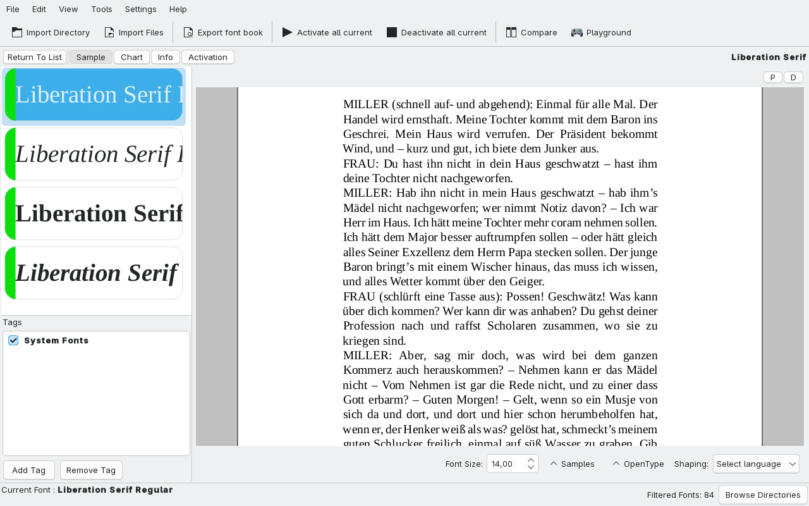

# Fontmatrix

Fontmatrix is a font management application for Linux and Windows.

It helps keeping your font collection in order, allowing you to enable and 
disable availability of fonts and font families in your system. This is typically
in demand by designers who tend to have huge collections of typefaces.

Searching for the right font in Fontmatrix is easy thanks to advanced support 
for [PANOSE](https://en.wikipedia.org/wiki/PANOSE) and user defined filters,
as well as tags.

Fontmatrix is also useful for type designers and enthusiasts, because it 
simplifies testing of OpenType features and allows comparing fonts glyph by 
glyph which is extremely useful for learning type design.

The project was originally developed by Pierre Marchand between 2007 and 2011.
It is currently maintained by Blagovest Petrov.

Bug reports, questions and patches go to the
[GitHub issue tracker](https://github.com/eniac111/fontmatrix/issues).

The old mailing list is archived and kept for historical purposes only; it is
no longer used for communication:

https://www.mail-archive.com/undertype-users@gna.org/maillist.html

Fontmatrix is currently not shipped for macOS, and macOS contributors are
wanted. Flatpak build is
[available on Flathub](https://flathub.org/apps/details/com.github.fontmatrix.Fontmatrix), 
AppImage build could be created by interested contributors.
